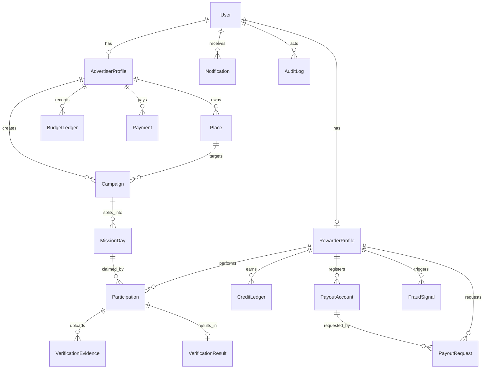

## LocalMom ERD (Mermaid)

아래 ERD는 `prisma/schema.prisma`의 핵심 모델 관계를 기준으로 작성했습니다.

---

## 관계 설명(요약)

- **User ↔ (AdvertiserProfile/RewarderProfile)**: 한 유저는 역할에 따라 프로필을 가짐
- **Campaign → MissionDay**: 캠페인은 기간을 “일 단위 미션”으로 분해
- **MissionDay → Participation**: 리워더가 슬롯을 확보하면 참여가 생성됨
- **Participation → Evidence/Result**: 인증 제출 및 검수 결과
- **Ledger**: 크레딧/예산은 원장으로 정합성 유지

