# 체험단 시스템 프로세스 매뉴얼

## 목차
1. [개요](#개요)
2. [전체 프로세스 흐름](#전체-프로세스-흐름)
3. [역할별 상세 프로세스](#역할별-상세-프로세스)
   - [광고주 프로세스](#광고주-프로세스)
   - [관리자 프로세스](#관리자-프로세스)
   - [팀장 프로세스](#팀장-프로세스)
   - [일반 회원 프로세스](#일반-회원-프로세스)
4. [상태 및 용어 설명](#상태-및-용어-설명)
5. [주의사항](#주의사항)

## 개요

체험단 시스템은 광고주가 제품/서비스 체험 기회를 제공하고, 회원들이 팀을 구성하여 체험을 진행한 후 결과를 공유하는 플랫폼입니다.

### 시스템 목표
- 광고주: 효과적인 마케팅 및 제품 피드백 수집
- 회원: 무료 체험 기회 및 보상 획득
- 플랫폼: 신뢰할 수 있는 체험단 서비스 제공

### 주요 특징
- 팀 기반 체험 진행
- 자료 및 컨텐츠 제출
- 통계 기반 리포트 제공
- 안전한 결제 및 보상 시스템

## 전체 프로세스 흐름

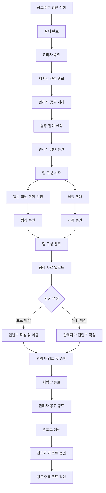

## 역할별 상세 프로세스

### 광고주 프로세스

#### 광고주 전체 프로세스 흐름도

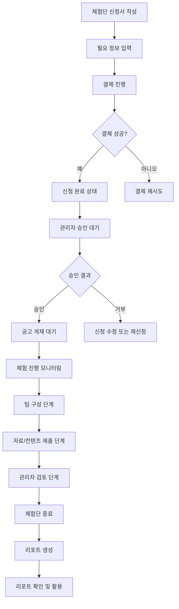

#### 1. 체험단 신청
- **대상**: 제품/서비스를 홍보하고 싶은 광고주
- **방법**: 광고주 대시보드에서 체험단 신청서 작성
- **필요 정보**:
  - 체험단 제목 및 설명
  - 제품/서비스 상세 정보
  - 체험 기간 및 조건
  - 보상 금액 및 방식
  - 참여자 수 및 팀 구성 요구사항

#### 2. 결제 및 승인 대기
- **결제**: 신청 완료 후 결제 진행
- **승인**: SUPER/MANAGER 권한의 관리자가 신청 내용 검토 후 승인
- **상태 변화**: 결제 완료 → "신청 완료"

#### 3. 체험 진행 모니터링
- **공고 게재 확인**: 관리자가 공고를 게재하면 회원들이 참여 시작
- **진행 상황**: 팀 구성부터 컨텐츠 제출까지의 진행 상황 확인 가능

#### 4. 결과 확인
- **리포트 수령**: 체험단 종료 후 생성되는 통계 리포트 확인
- **내용 포함**:
  - 참여 팀 및 회원 통계
  - 제출된 자료 및 컨텐츠
  - 체험 결과 분석

### 관리자 프로세스

#### 관리자 권한 구조도

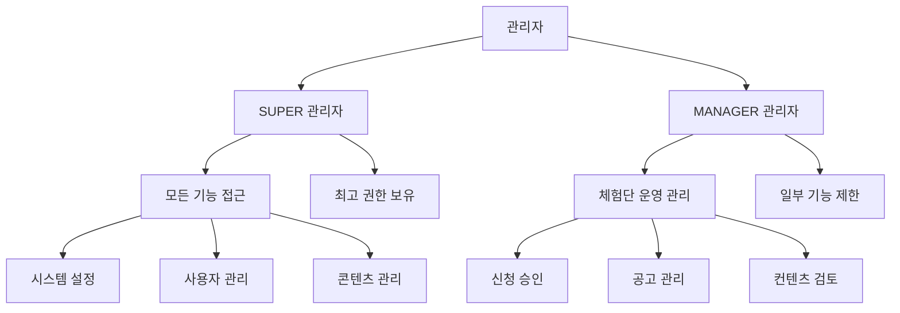

#### 관리자 업무 흐름도

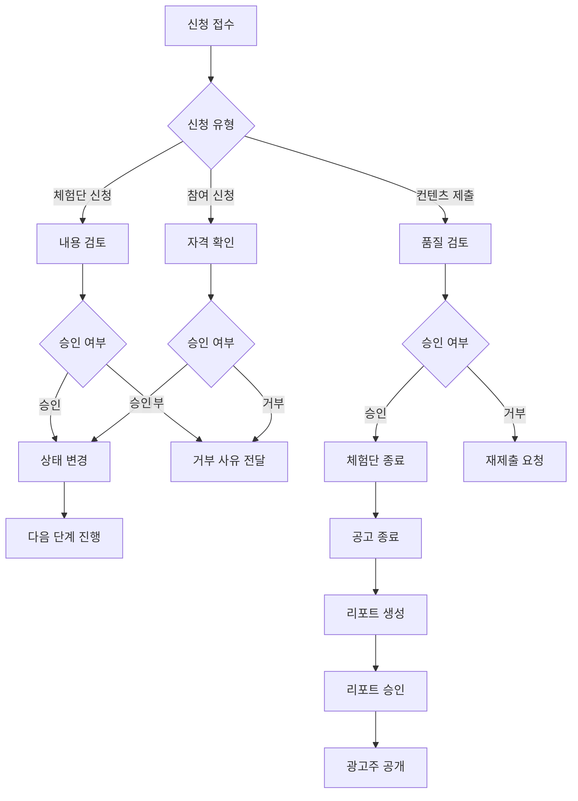

#### 권한 분류
- **SUPER**: 최고 권한, 모든 기능 접근 가능
- **MANAGER**: 체험단 운영 관리 권한

#### 주요 업무

##### 1. 체험단 신청 승인
- **대상**: 결제 완료된 광고주 신청
- **검토 항목**:
  - 신청 내용 적절성
  - 결제 완료 확인
  - 플랫폼 정책 준수 여부
- **결과**: 승인 시 "신청 완료" 상태로 변경

##### 2. 체험단 공고 게재
- **시기**: 체험단 신청 승인 후
- **내용**: 광고주 신청 정보를 바탕으로 회원들이 볼 수 있는 공고 작성
- **포함 정보**: 체험 조건, 기간, 보상, 참여 방법 등

##### 3. 참여 신청 승인
- **대상**: 팀장의 참여 신청
- **검토**: 신청 자격 및 적합성 확인
- **결과**: 승인된 팀은 팀 구성 단계로 진행

##### 4. 자료 및 컨텐츠 검토
- **대상**: 팀장이 제출한 자료와 컨텐츠
- **업무**:
  - 자료 완전성 확인
  - 컨텐츠 품질 검토
  - 플랫폼 정책 준수 여부 확인
- **결과**: 승인 시 체험단 종료, 불승인 시 재제출 요청

##### 5. 컨텐츠 작성 (일반 팀장 체험단)
- **시기**: 일반 팀장이 자료만 제출한 경우
- **내용**: 제출된 자료를 바탕으로 컨텐츠 작성 및 제출

##### 6. 공고 종료 및 리포트 생성
- **종료 시점**: 모든 팀의 체험 활동 완료 시
- **리포트 생성**: 통계 데이터와 제출 자료 포함
- **리포트 승인**: 내용 검토 후 광고주에게 공개

### 팀장 프로세스

#### 팀장 유형 분류도

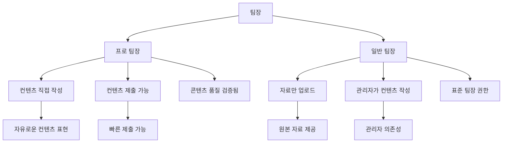

#### 팀장 업무 흐름도

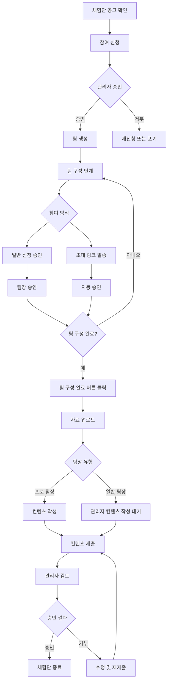

#### 팀장 유형
- **프로 팀장**: 직접 컨텐츠를 작성하여 제출 가능
- **일반 팀장**: 자료만 업로드하고 관리자가 컨텐츠 작성

#### 1. 참여 신청
- **자격**: Member 등급 이상
- **방법**: 체험단 공고에서 "참여 신청" 버튼 클릭
- **결과**: 팀 생성 및 팀장 권한 부여

#### 2. 팀 구성
- **참여 신청 관리**:
  - 일반 회원의 참여 신청 승인/거부
  - 승인된 회원은 팀원으로 등록
- **초대 기능**:
  - 초대 코드 생성
  - 초대 링크 공유
  - 초대받은 회원은 자동 승인

#### 3. 팀 구성 완료
- **시기**: 원하는 팀원 수 구성 완료 시
- **방법**: "팀 구성 완료" 버튼 클릭
- **상태 변화**: "팀 구성 중" → "팀 구성 완료"

#### 4. 자료 업로드
- **형식**: ZIP 파일 (최대 300MB)
- **내용**: 체험 중 생성된 사진, 영상, 문서 등 모든 자료
- **시기**: 팀 구성 완료 후

#### 5. 컨텐츠 제출
- **프로 팀장**: 직접 컨텐츠 작성 및 링크 제출
- **일반 팀장**: 관리자가 컨텐츠 작성 (제출 대기)

### 일반 회원 프로세스

#### 일반 회원 참여 흐름도

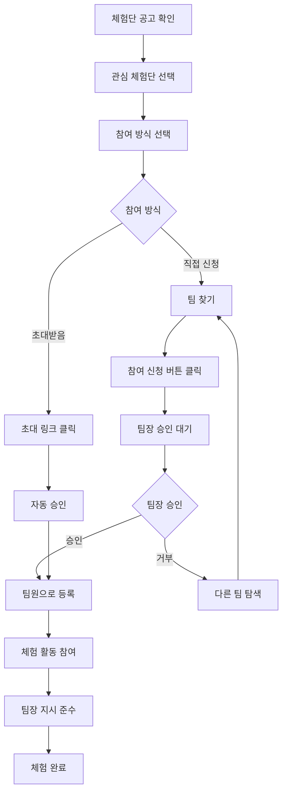

#### 1. 체험단 공고 확인
- **접근**: Member 페이지에서 체험단 목록 확인
- **정보**: 체험 조건, 기간, 보상 등 상세 정보

#### 2. 팀 참여 신청
- **방법**:
  - 참여 희망 팀 찾기
  - "참여 신청" 버튼 클릭
- **결과**: 팀장 승인 대기 상태

#### 3. 초대받아 참여
- **방법**: 팀장으로부터 받은 초대 링크 클릭
- **결과**: 자동으로 팀원으로 승인

#### 4. 체험 활동
- **역할**: 팀 구성원으로 체험 참여
- **업무**: 팀장이 지시하는 체험 활동 수행

## 상태 및 용어 설명

### 체험단 상태 전이도

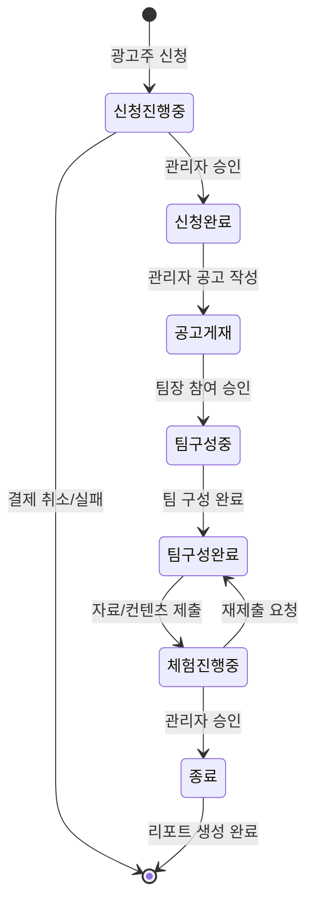

### 팀 상태 전이도

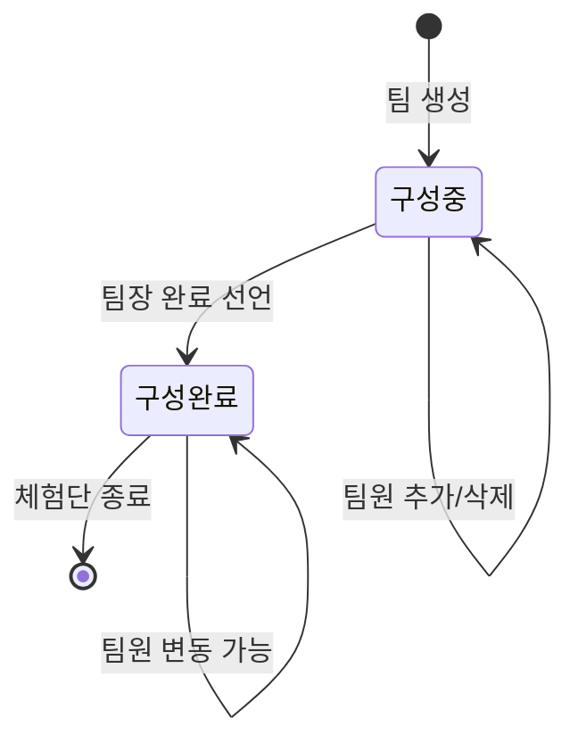

### 체험단 상태
- **신청 진행중**: 광고주 신청 후 결제 대기
- **신청 완료**: 관리자 승인 완료
- **공고 게재**: 회원들이 참여할 수 있는 상태
- **팀 구성 중**: 팀장 승인 후 팀원 모집 중
- **팀 구성 완료**: 팀 구성 완료, 자료 업로드 가능
- **체험 진행중**: 자료/컨텐츠 제출 완료, 검토 대기
- **종료**: 모든 활동 완료

### 팀 상태
- **팀 구성 중**: 팀원 모집 및 승인 진행 중
- **팀 구성 완료**: 팀 구성 완료, 체험 시작 가능

### 사용자 역할 구조도

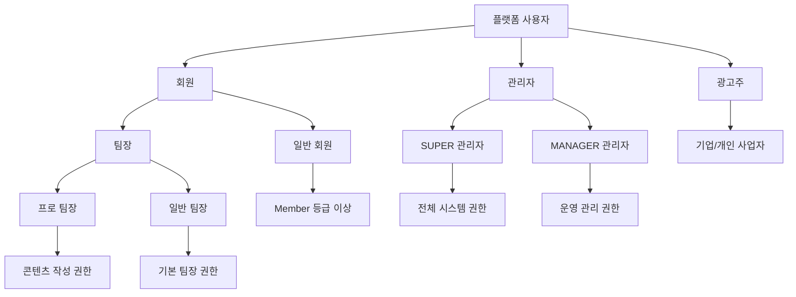

### 사용자 역할
- **관리자 (SUPER/MANAGER)**: 플랫폼 운영 및 체험단 관리를 담당
- **팀장**: 팀을 생성하고 이끌어 체험을 진행하는 회원
- **프로 팀장**: 컨텐츠 작성 능력이 검증된 팀장
- **일반 팀장**: 표준 팀장 권한을 가진 회원
- **일반 회원**: 팀원으로 참여하는 회원

### 주요 용어
- **체험단 공고**: 회원들이 볼 수 있는 체험단 모집 정보
- **참여 신청**: 팀장이 하는 체험단 참여 의사 표시
- **초대 코드**: 팀장이 팀원을 초대하기 위한 고유 코드
- **자료**: 체험 중 생성된 원본 파일 (사진, 영상 등)
- **컨텐츠**: 자료를 가공하여 완성된 최종 결과물
- **리포트**: 체험단 결과를 정리한 통계 및 분석 자료

## 주의사항

### 프로세스 중요 포인트 요약도

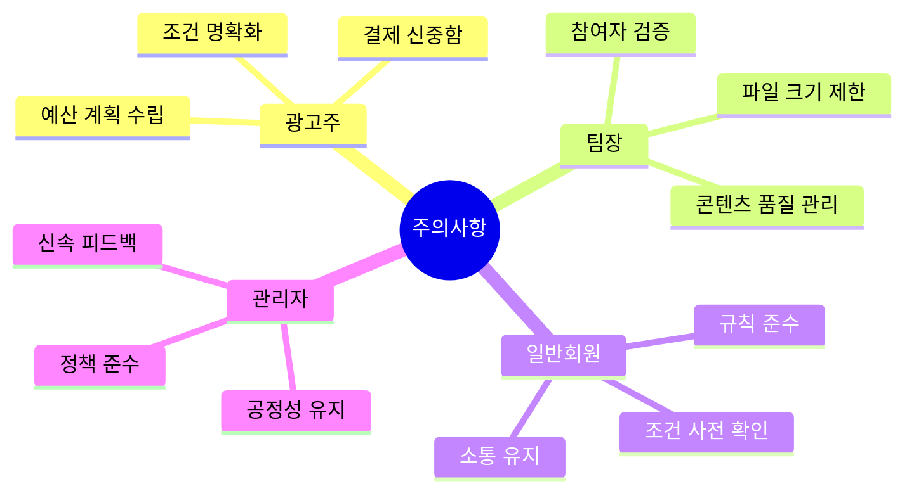

### 광고주 주의사항
- 신청 전 정확한 예산 및 일정 계획 수립
- 체험 조건을 명확히 작성하여 오해 방지
- 결제 후 취소 불가하니 신중한 결정 필요

### 팀장 주의사항
- 팀 구성 시 참여자 자격 및 의사 확인
- 자료 업로드 시 파일 크기 제한 준수 (300MB)
- 컨텐츠 품질에 대한 책임 의식 필요

### 일반 회원 주의사항
- 참여 신청 전 체험 조건 및 기간 확인
- 팀장과의 원활한 소통 유지
- 플랫폼 정책 및 규칙 준수

### 관리자 주의사항
- 공정한 승인 프로세스 유지
- 검토 시 플랫폼 정책 철저 준수
- 신속한 피드백 제공으로 사용자 만족도 향상

---

*이 매뉴얼은 체험단 시스템의 현재 프로세스를 기반으로 작성되었습니다. 시스템 업데이트에 따라 내용이 변경될 수 있습니다.*
